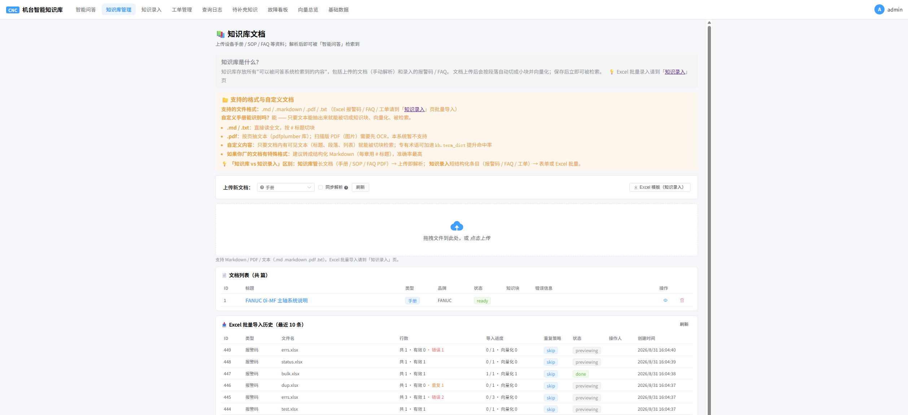

# CNC 机台智能知识库 · 前端

面向 **MES / 设备运维** 的工业垂直领域 **RAG + Agent** 系统的 Web UI（Vue 3 + TypeScript）。后端负责混合检索 / Agent / SSE 流式，本仓库把这些能力接入交互界面。

> 配套后端（同一产品双语言实现）：
> - 🔗 Python：[`CNC_Agent`](https://github.com/gdhAgent/CNC_Agent)
> - 🔗 .NET：[`CNC_AgentCore`](https://github.com/gdhAgent/CNC_AgentCore)
>
> 后端 /api 由 Vite 开发代理转发到本地后端（默认 `http://127.0.0.1:8000`），前端本身不含任何密钥。

---

## ✨ 界面一览

| 路由 | 视图 | 说明 |
|---|---|---|
| `/login` | **LoginView** | 登录（JWT，按角色/权限渲染导航） |
| `/` | **ChatView** | 主界面：左栏召回 TopK（含通道标签）+ 右栏结构化分析流式输出，引用 `[n]` 点击联动 |
| `/knowledge` | **KnowledgeView** | 知识库 / 文档管理：上传、解析状态、列表与删除 |
| `/entry` | **EntryView** | 知识录入：手动表单 / Excel 批量导入 / 导出（保存即向量化） |
| `/trace/:traceId` | **TraceView** | 检索排查：检索步骤时间轴 + 多路排名对比 |
| `/suggestions` | **SuggestionView** | 待补充知识清单（拒答 / 差评自动汇集，审核闭环） |
| `/workorders` | **WorkOrderView** | 工单管理 |
| `/base-data` | **BaseDataView** | 基础数据维护（品牌 / 类别 / 严重度 / 故障类型） |
| `/vectors` | **VectorView** | 向量库总览（维度统计 / 未向量化 / 可视化） |
| `/dashboard` | **DashboardView** | 高频故障 Top-N 看板 |
| `/query-logs` | **QueryLogView** | 查询日志 / 检索过程浏览 |

管理功能（用户、角色权限矩阵等）以组件形式内嵌于相应视图。

## 🚀 快速开始

依赖：Node 18+。先把任意一个后端按它的 README 跑起来（监听 `8000`）。

```bash
npm install
npm run dev        # http://localhost:5173 ，/api 自动代理到 127.0.0.1:8000
```

如果后端端口不同，改 `vite.config.ts` 里的代理 target 即可。

### 构建 / 预览

```bash
npm run build        # vue-tsc 类型检查 + vite 打包到 dist/
npm run preview      # 本地预览生产包
```

## 🛠 技术栈

| 层 | 选型 |
|---|---|
| 框架 | Vue 3（`<script setup>`）+ TypeScript |
| 构建 | Vite（dev 代理 /api → 后端） |
| UI | Element Plus（zh-cn，按需引入） |
| 状态 | Pinia（含流式状态与中断控制） |
| 路由 | vue-router（懒加载，history 模式） |
| HTTP / SSE | axios；@microsoft/fetch-event-source（支持 POST + 命名事件的 SSE） |

## 📁 目录结构

```
CNC_Web_Agent/
├─ src/
│  ├─ api/            http.ts（axios 封装）/ sse.ts（SSE 客户端）
│  ├─ types/index.ts  与后端接口对齐的 TS 类型
│  ├─ stores/         chat / auth / baseItems（Pinia）
│  ├─ components/     QueryBar / RetrievalPanel / AnalysisPanel / CitationRef /
│  │                  ToolTrace / FeedbackBar / DeviceTab / EntriesTab /
│  │                  UsersTab / PermissionMatrixTab / UserMenu …
│  ├─ views/          Chat / Knowledge / Entry / Trace / Suggestion / Dashboard /
│  │                  WorkOrder / BaseData / Vector / QueryLog / Login
│  ├─ router/index.ts
│  ├─ App.vue / main.ts / style.css
├─ public/
├─ vite.config.ts      /api 代理 → http://127.0.0.1:8000
├─ package.json
└─ tsconfig*.json
```

## 界面截图

> 演示环境运行后补充截图，放至 `assets/screenshots/` 并替换下方占位即可。

| 主界面（左右分栏 + 流式） | 检索排查页（时间轴） | 知识管理 / 录入 |
|---|---|---|
|  |  |  |

## 数据与免责声明

- 展示的设备台账与维修工单均为仿真数据（`is_demo = true`），不含真实企业信息。
- 本系统为**故障检索与辅助分析工具**，输出仅供参考，**不可作为机床操作、维修或安全决策的唯一依据**，实际作业请遵循设备厂商官方手册与工厂安全规程。
